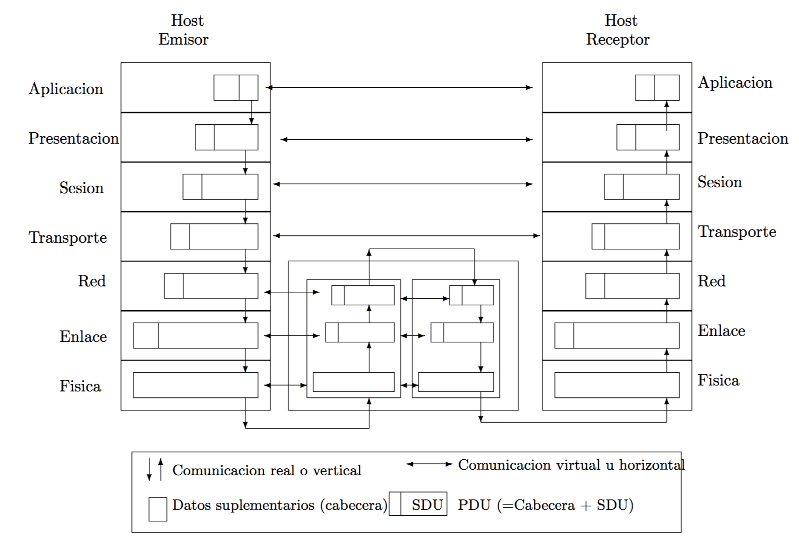
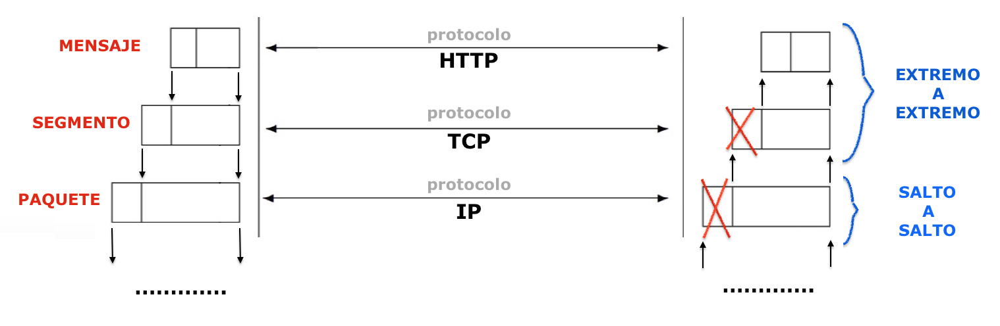
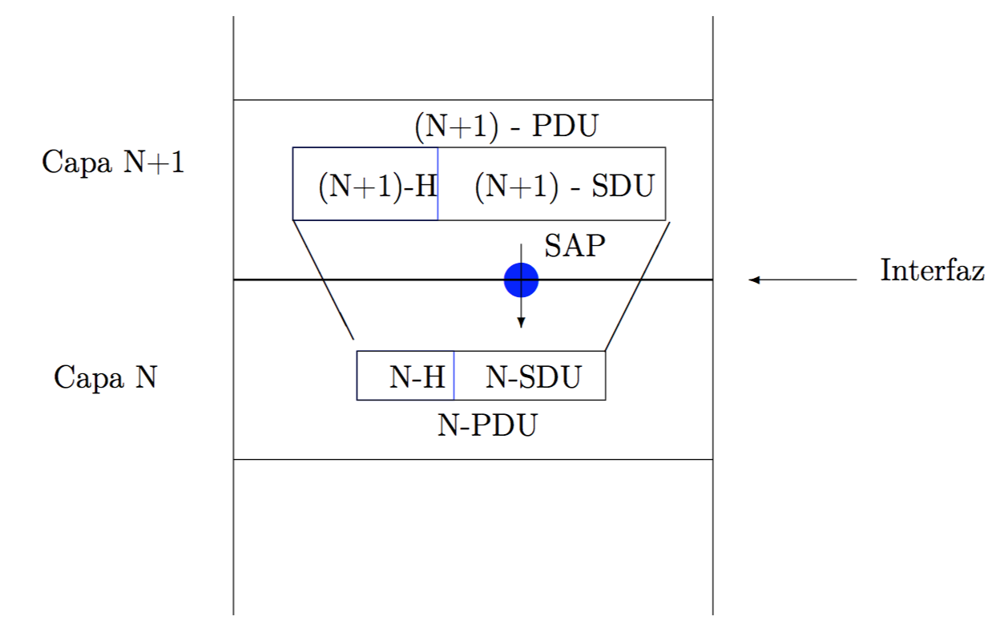

# COMUNICACIÓN REAL Y COMUNICACIÓN VERTICAL

 

Dadas dos capas adyacentes N y N + 1, la capa inferior se denomina **proveedora de servicios** y la superior **usuaria de servicios**, ya que la capa N ofrece una serie de servicios transparentes a **N + 1**.
Los elementos hardware o software de una capa se conocen como entidades de nivel **N** . Las entidades de nivel **N** en el emisor y en el receptor se llaman entidades pares o paritarias, ya que se conectan dos a dos.
Hay dos tipos de comunicación entre el emisor y el receptor:
- **Real o Vertical:** flujo que sigue la información entre el emisor y el receptor, intercambio de datos entre capas adyacentes, en sentido descendente (aplicación a física) en el emisor y ascendente (física a aplicación) en el receptor.
- **Virtual u Horizontal:** comunicación entre entidades paritarias. Para hacer una función se necesita la colaboración de las entidades pares emisora y receptora. Por eso en cada capa (menos en la física) se añade una cabecera para ayudar a comunicar a las partes involucradas.

- En relación con la **comunicación horizontal**, un **protocolo** es el conjunto de reglas y convenciones que se tienen que aplicar en una comunicación entre dos entidades. A las capas y protocolos asociados se les denominan arquitectura de red. En este sentido OSI no es una arquitectura porque no se definen los protocolos, mientras que TCP/IP sí es una arquitectura, ya que en cada capa se conocen los protocolos que se tienen que tener en cuenta. La especificación en capas de una arquitectura de red se conoce como pila de protocolos.
- Respecto a la comunicación vertical de las capas se realiza mediante la interfaz, más concretamente con los puntos de acceso (Service Access Points; SAP). Dentro de la información que se transmite en los SAP se distinguen la unidad de datos de servicio (Service Data Unit; SDU) son los datos que se manejan por la en- tidad (los que se quieren enviar) y vienen de la capa superior; y la unidad de datos de protocolo (Protocol Data Unit; PDU) que es la cabecera añadida para llevar a cabo las operaciones desarrolladas con las entidades paritarias. A continuación se puede ver cómo actúan todos estos conceptos:

