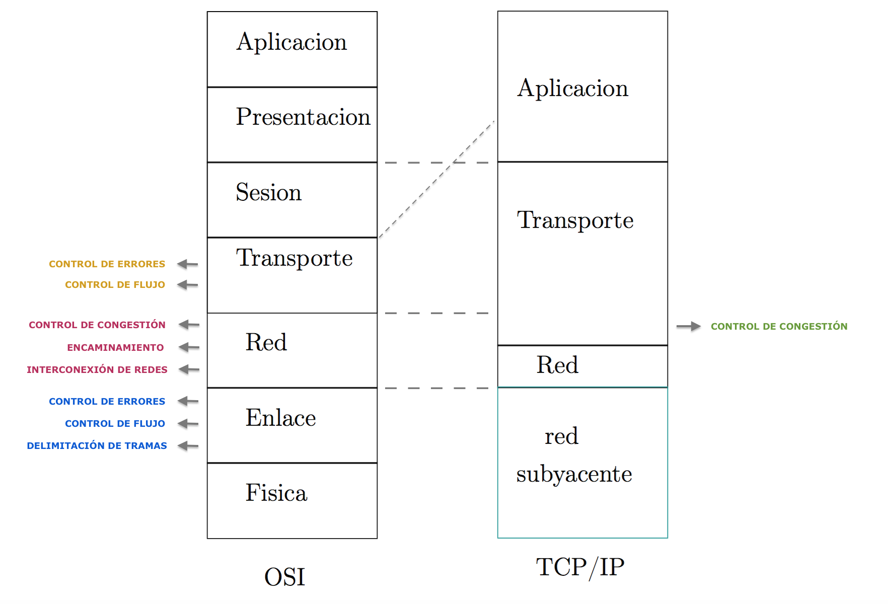

# MODELO DE CAPAS TCP/IP

El modelo OSI tiene capas con muy poco contenido, por eso, en otros modelos se emplea un número menor de capas mediante trasvase de funciones asociadas a otros niveles resumiéndose así el modelo de referencia. En TCP/IP (el modelo que se usa en internet, ha triunfado lo sencillo) hay sólo tres capas. TCP/IP habla de protocolos concretos.

*La capa superior siempre encapsula a la inferior.

    ______________________________
    Unidad              Capa                Comunicación
    ------          -------------           ------------
    Mensajes        Aplicación              |   Extremo
    Segmentos       Transporte              |      a extremo
    ---------------------------------------------------------->     
    Paquetes        Red                     |   Salto a salto
    ---------|----|-------------------------------------------> API
                    Red Subyacente          |   Todo lo que tiene que ver con el medio físico
    _______________________________

## DESCRIPCIÓN DE LAS CAPAS:

### --------------------> Comunicación salto a salto:
- ***CAPA DE RED:*** Tiene tres funciones principales:
    - **Encaminamiento:** Garantiza que un paquete que sale de un origen llega a un destino, resolviendo el camino que tienen que elegir los paquetes a través de los nodos. Procesa paquetes que es su unidad de datos. 
    - **Interconexión de redes:** posibilita la transmisión de datos entre estaciones finales situadas en redes distintas.

### --------------------> Comunicación extremo a extremo:
- ***CAPA DE TRANSPORTE:*** controla la comunicación de host (extremo) a host (extremo), es decir, controla que la transmisión de datos entre los dos hosts se haga correctamente. Ejemplo: corregir la información en vez de reenviar. Otra función de esta capa es la de multiplexar aplicaciones sobre una misma conexión de red.
    - **Control de congestión:** evita la saturación de la capacidad de la subred como consecuencia de un elevado tráfico. Se soluciona enviando paquetes por otras rutas o ralentizando la conexión.
    - **Control de errores:** para conseguir que la información recibida se corresponda con la enviada.
    - **Control de flujo:** para evitar que el emisor sature el buffer  de recepción del destino debido a una velocidad u ocupación diferente de las dos partes. El receptor frena al origen para que el destino vaya a una velocidad adecuada. También controla si la conexión se ha parado.
- ***CAPA DE APLICACIÓN:*** es la capa donde interactúan los usuarios, los programadores también programan en esta capa. Servicios de usuario como telnet(accesoremoto),ftp(transferencia de ficheros), smtp (correo electrónico), http (web), etc.

TCP/IP es una red software, ya que puede implementarse sobre cualquier tecnología de red sin ser dependiente de ella, por ello, TCP/IP es el modelo más extendido en la actualidad y un ejemplo de **de facto**. ¿Por qué en TCP/IP no se considera la red subyacente como parte del modelo? Porque TCP/IP es software estándar, pero la red subyacente puede variar en cada ordenador. Los modelos de red son estándares y hay dos tipos:

- **de facto**: han sido adoptados sin haber seguido un proceso de estandarización formal.
- **de jure:** han sido desarrollados por organismos de estandarización reconocidos.