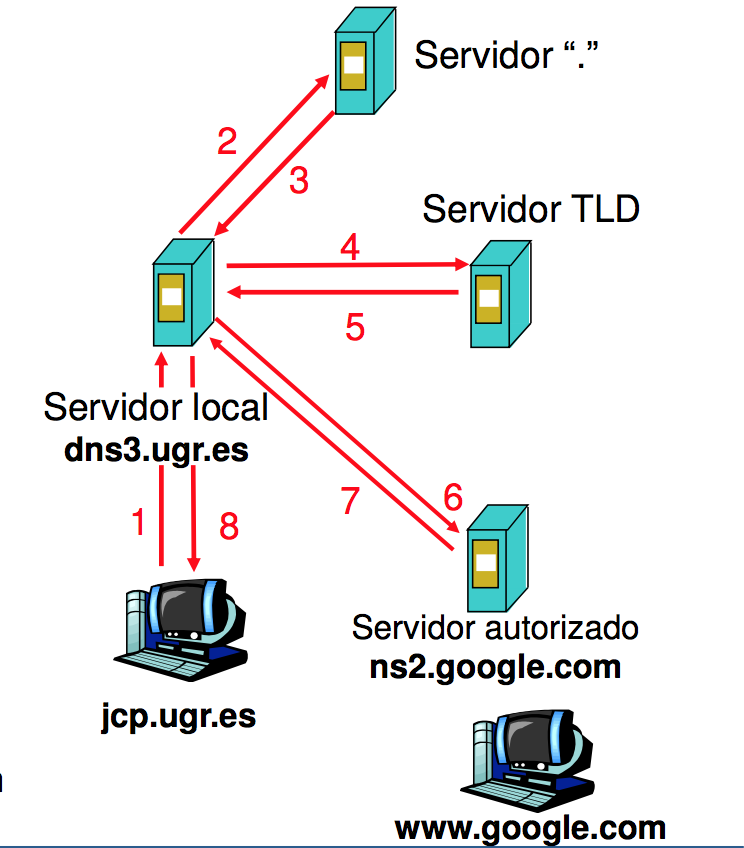
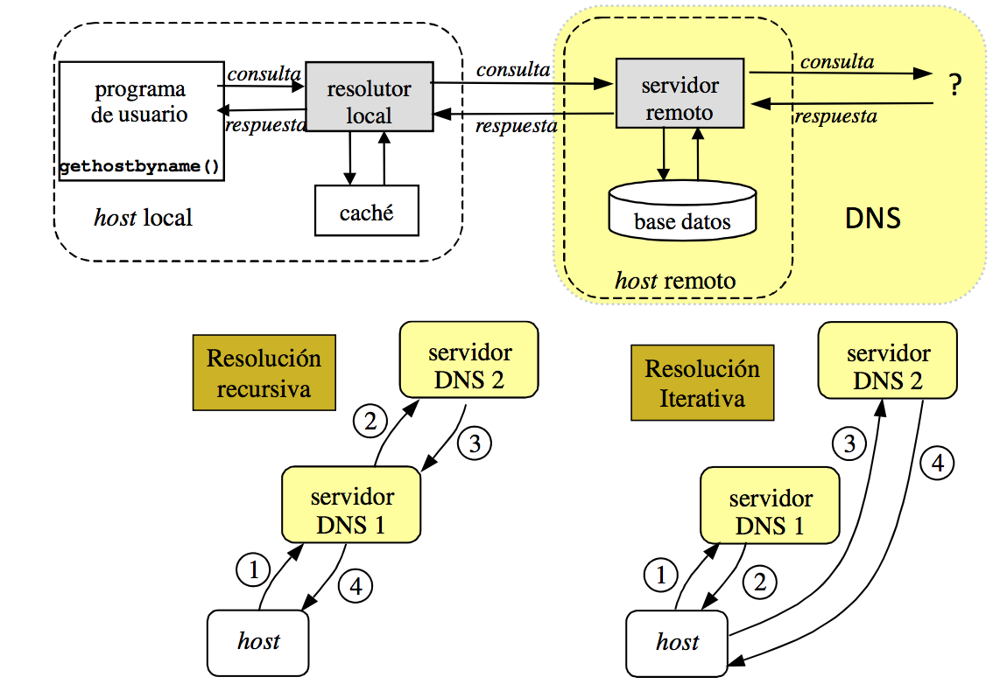
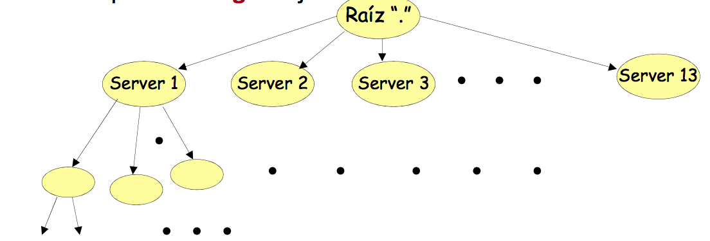
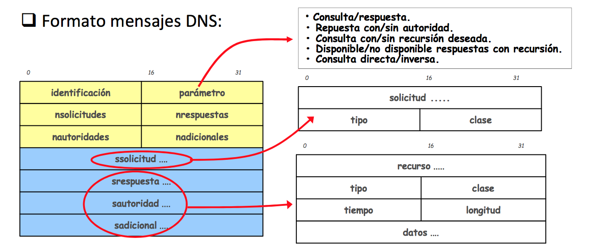

# SERVICIO DE NOMBRES DE DOMINIO (DNS)

**DNS:** traducción de nombres a direcciones IP (resolución de nombres). La comunicación en Internet precisa de direcciones IP, pero las personas prefieren usar “nombres de dominio”. Estructura jerárquica en dominios:
    
    Parte_local.dominio_niveln. ... .dominio_nivel2.dominio_nivel1.

- Al dominio de nivel1 se le denomina dominio genérico (.com .es .edu etc).
- El dominio raíz o “.” está gestionado por el ICANN (Internet Corporation for Assigned Names and Numbers; http://www.icann.org), que suele delegar en centros regionales.
- DNS es un protocolo para el acceso a una base de datos distribuida con una gestión distribuida:
    - **Servidores raíz “.”**
    - **Servidores de dominio (Top-Level domain o TLD).**
    - **Servidores Locales.**

- jcp.ugr.es solicita --> www.google.com
    - Consulta al “resolver” local.
    - Conexión con DNS local (IP conocida) ¿cómo?.
    - DNS local --> IP de destino.
    - Conexión destino.

### Resolución iterativa o recursiva y el uso de caché.

### Gestión de la base de datos distribuida y jerárquica:

- Está formada por un conjunto de servidores cooperativos que almacenan parcialmente la base de datos que se denomina (Berkeley Internet Name Domain).
- Cada servidor es responsable de lo que se denomina ZONA.
- Una zona es un conjunto de nombres de dominio contiguos (por debajo de uno dado en el árbol) de los que el servidor tiene toda la información y es su autoridad.
- Los servidores autoridad deben contener toda (no “cacheada”) la información de su zona.
- La autoridad puede delegarse jerárquicamente a otros servidores.

### Gestión de la base de datos DNS:
- Cada zona debe tener al menos un servidor de autoridad.
- En cada zona hay servidores primarios (copia master de la db) y secundarios (obtiene la db por transferencia).
- Además, existe un servicio de cache para mejorar prestaciones.
- La topología real de servidores es complicada: existe 13 servidores raiz (A-M).
- El root-server F (y otros) tiene un servidor en Madrid (Espanix: punto neutro).
- Cuando un cliente (a través de un resolver local ) solicita una resolución de nombres a su servidor puede ocurrir:
    - **Respuesta CON autoridad:** el servidor tiene autoridad sobre la zona en la que se encuentra el nombre solicitado y devuelve la dirección IP.
    - **Respuesta SIN autoridad:** el servidor no tiene autoridad sobre la zona en la que se encuentra el nombre solicitado, pero lo tiene en la cache.
    - **No conoce la respuesta:** el servidor preguntará a otros servidores de forma recursiva o iterativa. Normalmente se “eleva” la petición a uno de los servidores raíz.

### La base de datos DNS

- Todo dominio está asociado al menos a un registro Resource Record.
- Cada RR es una tupla con 5 campos: Nombre del dominio, Tiempo de vida, Clase, Tipo y Valor.
- Existe una base de datos asociada de resolución inversa para traducir direcciones IP en nombres de dominio. (in-addr.arpa).

- **DNS se ofrece en el puerto 53 mediante UDP normalmente o TCP (para respuestas grandes > 512 bytes).**