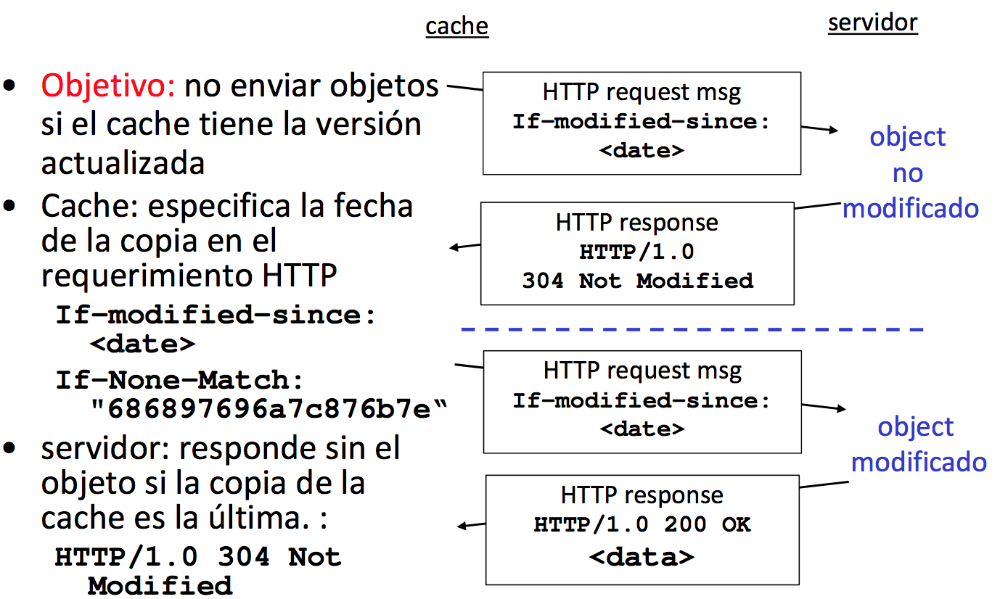

# PROTOCOLO HTTP

Modelo cliente-servidor:
- **Cliente:** browser que pide, recibe y muestra objetos web.
- **Servidor:** envia objetos web en respuesta a peticiones.

### Características:

- Usa los servicios de TCP en el puerto 80. Inicio de conexión TCP, envío HTTP, cierre de conexión TCP.
- HTTP es “stateless”, utiliza Cookies. El servidor no mantiene información sobre las peticiones de los
clientes.
- Existen dos tipos:
    - **No persistente:** se envia únicamente un objeto en cada conexión TCP.
    - **Persistente:** Pueden enviarse multiples objetos sobre una única conexión TCP entre cliente y servidor.

### Navegación web: Mensajes HTTP.

**Procedimiento:**
1a. Cliente HTTP inicia conexión TCP al servidor HTTP (proceso) en www.ugr.es en puerto 80.
1b. Servidor HTTP acepta la conexión y notifica el cliente.
2. Cliente HTTP envía request message del objeto.
3. El servidor HTTP envia el mensaje a través su socket.
4. Si es persistente envía más objetos.
5. Cierre de conexión TCP.
6. Nuevas conexiones TCP.

**Procedimiento de mensajes:**
1. Solicitud DNS para obtener la IP de destino a partir del nombre de dominio.
2. Inicio de conexión TCP (3-way handshake).
    - Primer segmento sólo cabeceras con flag SYN.
    - Segmento ACK ante la recepción de SYN(+ACK) del otro par.
3. Solicitudes HTTP:
    - Paquete HTTP con la solicitud GET de la página.
    - Iterativas solicitudes en este u otros flujos TCP (iniciados según 2) ) de los objetos incrustados en la página.

Dos tipos de mensajes HTTP: **request**, **response**.

### Web Caché.

**Objetivo:** satisfacer el requerimiento del cliente sin involucrar al servidor destino.
- Usuario configura el browser: Acceso Web vía cache.
- Browser envía todos los requerimientos HTTP al cache.
    – Si objeto está en caché: caché retorna objeto.
    – Sino caché requiere los objetos desde el servidor Web, y retorna el objeto al cliente.

**Ejemplo:**

### MÉTODOS

– OPTIONS: solicitud de información sobre las opciones disponibles.
– GET: solicitud de un recurso (puede ser condicional).
– HEAD: igual que GET pero el servidor no devuelve el “cuerpo” sólo cabeceras.
– POST: solicitar al servidor la aceptación y subordinación a la URI especificada, de la “entidad” (datos) incluida en la solicitud.
– PUT: solicitud de sustituir la URI especificada con los “datos” incluidos en la solicitud.
– DELETE: solicitud de borrar la URI especificada.

### Las cookies.

Las cookies son pequeños ficheros de texto que se intercambian los clientes y los servidores HTTP, para solucionar una de las principales deficiencias del protocolo: la falta de información de estado entre dos transacciones. Fueron introducidas por Netscape.
- La primera vez que un usuario accede a un determinado documento de un servidor, éste proporciona una cookie que contiene datos que relacionarán posteriores operaciones.
- El cliente almacena la cookie en su sistema para usarla después. En los futuros accesos a este servidor, el navegador podrá proporcionar la cookie original, que servirá de nexo entre este acceso y los anteriores.
- Todo este proceso se realiza automáticamente, sin intervención del usuario.

Una cookie es simplemente una serie de líneas de texto, con pares variable/valor. Existe un conjunto predefinido de nombres de variable, necesarias para el correcto funcionamiento de las cookies: domain, path, version, expires. 
Un servidor HTTP envía los diferentes campos de una cookie con la nueva cabecera HTTP Set-Cookie:

    Set-Cookie: Domain=www.unican.es; Path=/; Nombre=Luis; Expires Fri, 15-Jul-97 12:00:00 GMT

Cuando se accede a una URL que verifica el par dominio/path registrado, el cliente enviará automáticamente la información de los diferentes campos de la cookie con la nueva cabecera HTTP Cookie:
    
    Cookie: Domain=www.unican.es; Path=/; Nombre=Luis