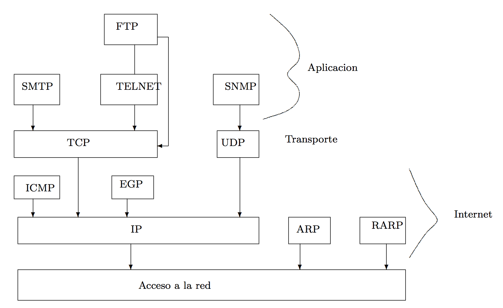
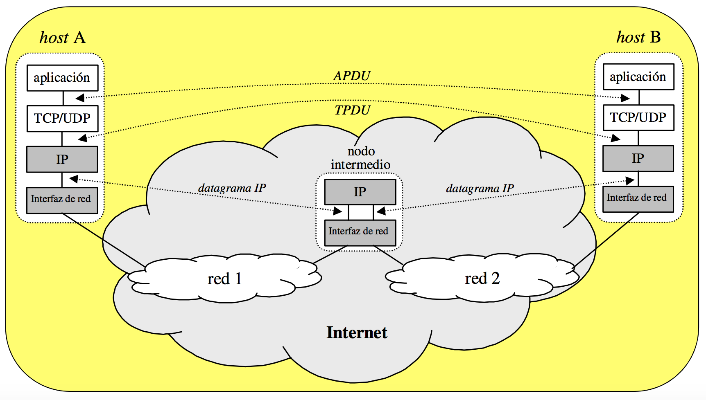

# PROTOCOLOS

- **DNS:** transformar nombres de dominio en direcciones IP.
- **SMTP:** para correo electrónico.
- **FTP:** para transferir archivos.
- **TELNET:** conexión entre una máquina y otra para administración remota.
- **SNMP:** para gestión de la red.
- **HTTP:** el protocolo de la web.
- **TCP:** protocolo que nos proporciona una conexión fiable.
- **UDP:** protocolo más “ligero” para una ejecución más eficiente, pero con menos funcionalidad que TCP, no tenemos servicio de vuelta, no ACK.
- **IP:** el protocolo más importante de la capa de internet.
- **ICMP:** también para gestión de redes. Protocolo del ping, parecido a SNMP.
- **EGP:** su principal uso es calcular la dirección destino, enrutamiento.
- **ARP:** su principal uso es calcular direcciones MAC. Su inverso es RARP.

# TERMINOLOGÍA:

- **Tipos de mensajes:** los ejemplos más tipicos de mensajes son de petición (request) y respuesta (response).
- **Sintaxis:** está definida por la estructura de “campos” en el mensaje, es decir, debe tener un formato.
- **Semántica:** se refiere al significado de dichos “campos”.
- **Reglas:** se refiere a cuándo los procesos envían/responden a mensajes. Para que la comunicación sea efectiva debe hacerse siguiendo unas reglas.
- **Protocolos de dominio público:** están definidos en los RFCs. Normalmente buscan ser estándarizados. Por ejemplo HTTP, SMTP, etc.
- **Protocolos propietarios:** al contrario que los de dominio público, son creados por una empresa e implantados en un producto. Estas empresas intentan esconderlo lo máximo posible para que nadie sepa cómo funciona el protocolo.
- **In-band versus out-of-band:** Los protocolos In-band mandan en el mismo paquete la información completa, tanto de datos como de control (HTTP) y los protocolos Out-of-band usan canales distintos para cada cosa (FTP). Por ejemplo, FTP envía la información de control (usuario, contraseña, comandos get/post, etc) por una conexión y los datos, por otra conexión paralela separada.
- **Stateless versus state-full:** Los protocolos stateless no guardan información del cliente, a no ser que tengan una intranet o un fichero como las cookies. Los protocolos state-full son servicios que guardan el estado del cliente, por ejemplo, el carrito de la compra, si eres premium o no...
- **Persistentes vs no-persistentes:** Los protocolos persistentes siempre están conectados mientras que los no-persistentes, crean una conexión cada vez que se manda un trocito de información.
- **Best-effort:** hace el máximo esfuerzo por que el paquete llegue a su destino pero si no llega “le da igual”, no se preocupa en realizar el reenvío del paquete.
- **Calidad de servicio (QoS):** capacidad de ofrecer el rendimiento requirido para una aplicación.
- **Piggybacking:** función importante dentro del flujo de detección que minimiza el número de paquetes enviados de señalización de control: en vez de enviar los ACKs como segmentos separados, los envía dentro de otros paquetes que incluyen datos.

