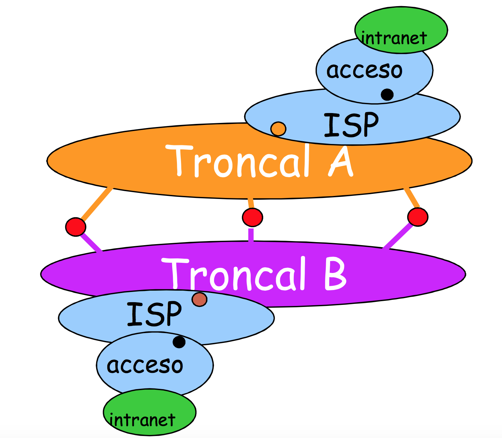

# SERVICIOS

Los servicios que ofrece cada una de las capas pueden ser:

- **Orientado a conexión (OC):** exige que las dos entidades pares tengan un estado común previo al intercambio de la información. Se establecerse una conexión como paso previo a la transmisión de datos entre el emisor y el receptor. Esta conexión se realiza enviando un paquete de un tamaño por parte del host emisor que el host receptor debe devolver. Cuando se ha devuelto, comienza el envío del resto de paquetes con la información a enviar. Se hace cuando sí importa que la información que se envía llegue al receptor. Ejemplo: teléfono.
    TCP->OC. Exige que se pongan deacuerdo las dos entidades para intercambiar la información.
- **No orientado a conexión (NOC):** en este caso,no se necesita que haya una conexión entre los hosts previa, sino que el envío de información se haga con mucha rapidez. Un ejemplo de esto es la reproducción on-line de vídeos, donde no importa si se pierde un frame o dos, sino que lleguen los paquetes lo más rápido posible para que dé sensación de fluidez. Ejemplo: correo ordinario.
    UDP->NOC. No exige que se pongan deacuerdo las dos entidades para intercambiar la información.

A parte los servicios pueden ser:

- **Confirmado (ACK):** el host emisor tiene constancia de que al host receptor le ha llegado el paquete enviado.
- **No confirmado (NO ACK):** lo contrario al anterior.

Por ejemplo, una carta es un servicio no orientado a conexión, ya que al echar la carta al buzón ya nos olvidamos de ella. En cambio, una llamada telefónica es un servicio orientado a conexión, porque antes de iniciar la comunicación debe establecerse una conexión entre ambas partes y finalmente una desconexión.

# ARQUITECTURA

Existen varios tipos de red, estableciendo una topología jerárquica:

- **Intranets (Ethernet) del usuario:** zona pública+zona privada. Se requieren a las redes locales de cada usuario donde se incluyen direcciones privadas para su subred local y direcciones públicas para acceder a la red.
- **Redes de acceso:** xDSL(toda la familia DSL, por ejemplo, ADSL), RDSI, FTTH (Fibre To The Home (fibra óptica)), etc del ISP.
- **Redes troncales:** ATM, SDH, SONET, etc. . . de grandes operadores de telecomunicaciones. Un ejemplo de red troncal sería la red iris, que conecta a la comunidad investigadora y las distintas universidades en España. Hay varios tipos de redes troncales, según su tamaño: Tier-1, Tier-2 y Tier-3. Los **operadores** se clasifican en:
    - **Tier-1:** son operadores gigantes que pueden alcanzar cualquier IP del mundo usando sólo acuerdos de peering. Hay unos 13 o 14 en el mundo, Telefónica, Orange, ATP, NTTP,...
    - **Tier-2:** son operadores que pueden acceder a cualquier IP del mundo, pero para algunas zonas tienen que llegar a acuerdos de tránsito además de peering.
    - **Tier-3:** son operadores que acceden a IPs a través de acuerdos de tránsito. Ejemplo: Ono.

Los operadores llegan a acuerdos o contratos de:
- **Peering:** un contrato que establece un operador de telecomunicaciones con otro de intercambio de tráfico sin remuneración. Se realiza entre grandes operadores.
- **Tránsito:** un operador contrata la infraestructura para tráfico a cambio de dinero.

Los **puntos neutros** son puntos en los cuales las distintas redes ISP se interconectan para intercambiar tráfico. Están entre las redes troncales de dos compañías. Se llevan a cabo cuando ha habido un acuerdo de peering o de trásito entre operadores para evitar caminos no razonables.

- Para medir el tráfico entre operadores, se mide por la **regla del percentil95**.
- **MPLS** (Multiprotocol Label Switching): Opera entre la capa de enlace de datos y la capa de red del modelo OSI. Fue diseñado para unificar el servicio de transporte de datos para las redes basadas en circuitos y las basadas en paquetes. Puede ser utilizado para transportar diferentes tipos de tráfico, incluyendo tráfico de voz y de paquetes IP.

# DIRECCIONAMIENTO

Cuando queremos acceder a una página web, se forma un paquete de datos con una determinada información en las distintas capas que se iban trasmitiendo entre los distintos nodos a través de internet hasta llegar al destino, devolviendo la información requerida. El direccionamiento es la metodología a usar para identificar entidades, dependiendo de la capa, se hace de distintas formas:

- **Nombrededominio:** En la capa de aplicación, para direccionar, se usa el nombre de dominio debido a que la capa de aplicación es justo la que interacciona con nosotros y un nombre de dominio es más fácil de recordar. La capa lo traduce a direcciones IP que entiende la máquina.
- **Dirección IP:** se localiza en la capa de red e identifica a los host (tanto fuente como destino).
- **Puertos:** un puerto sirve para contestar peticiones que nos envíen otros dispositivos. Hay puertos de propósito específico, dinámicos, etc. Se localizan en la capa de transporte.

Hay dos tipos básicos de direcciones IP:

- **Públicas:** sólo direcciona a un dispositivo y se paga(o se alquila)por ella. Son unívocas, cada dirección se asigna sólo a un dispositivo en internet.
- **Privadas:** funcionan como un número de teléfono en una centralita. Son direcciones que se pueden repetir en el mundo, pero dentro de una red privada serán únicas (y fuera de ella lo serán si se suman a la IP del router). Cuando se abre un canal hacia una página web, la IP que aparece es la de nuestro router. Su razón de existencia se debe a que sin ellas, habríamos agotado hace ya mucho tiempo el número de dispositivos máximos que podemos conectar a internet.

Los rangos reservados para IPs privadas son:

- **10.0.0.0/8:** permiten tener 224 dispositivos conectados. Se usan en redes muy grandes y abarcan desde 10.0.0.0 a 10.255.255.255.
- **172.16.0.0/11:** son para redes intermedias, como la red de la UGR. Abarcan desde 172.16.0.0 a 172.31.255.255.
- **192.168.0.0/16:** son para redes pequeñas,16 veces más pequeñas que las anteriores. Abarcan desde 192.168.0.0 a 192.168.255.255.
